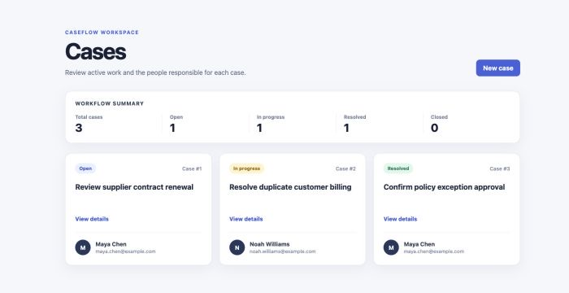
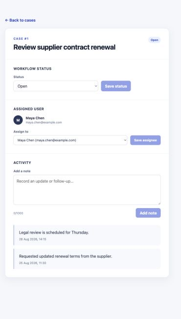
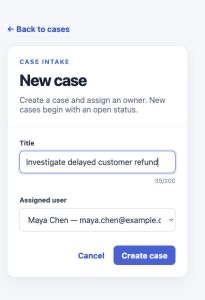
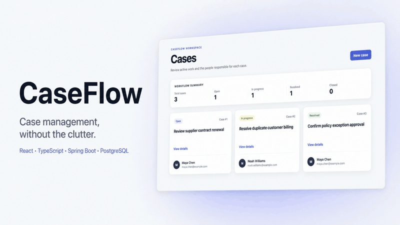
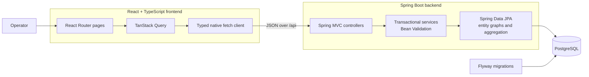

# CaseFlow

CaseFlow is a full-stack case-management workflow built to demonstrate a
complete React-to-PostgreSQL product slice. Operators can create and assign
cases, move work through a defined status lifecycle, record activity, and see
database-backed queue totals.



## Features

- Create a case for an existing user; the server owns the initial `OPEN` status.
- Review case details and move work through open, in-progress, resolved, and
  closed states.
- Reassign a case while keeping list and detail views synchronized.
- Add persistent activity notes and display the newest activity first.
- Calculate total and per-status workflow counts in PostgreSQL.
- Handle loading, empty, validation, error, retry, saving, and success states in
  the interface.

## Interface

| Case workflow | Responsive case intake |
| --- | --- |
|  |  |

## Demo



Watch the 22-second workflow demonstration: create and assign a case, update
its status, reassign ownership, add an activity note, and return to the queue
to see the database-backed summary refresh. A higher-quality
[MP4 version](docs/media/caseflow-demo.mp4?raw=1) is also available to download.

## Architecture



The repository intentionally remains one frontend, one backend, and one
PostgreSQL service. API records keep persistence entities out of the wire
contract, service methods define transaction boundaries, and Flyway owns the
database schema.

### Data synchronization

TanStack Query keeps related views consistent after mutations:

- Status and assignee updates replace the current detail cache and invalidate
  the case list.
- Status changes also invalidate the workflow summary.
- Case creation seeds the new detail cache, invalidates the list and summary,
  and then navigates to the new case.
- New activity is inserted at the beginning of the cached activity timeline.

## API

| Method | Endpoint | Purpose |
| --- | --- | --- |
| `GET` | `/api/cases` | List cases and their assigned users |
| `POST` | `/api/cases` | Validate and create an open case |
| `GET` | `/api/cases/summary` | Return total and per-status counts |
| `GET` | `/api/cases/{id}` | Return one case or `404` |
| `PATCH` | `/api/cases/{id}/status` | Validate and persist a status change |
| `PATCH` | `/api/cases/{id}/assignee` | Reassign a case to an existing user |
| `GET` | `/api/cases/{id}/activities` | List activity newest first |
| `POST` | `/api/cases/{id}/activities` | Validate and persist an activity note |
| `GET` | `/api/users` | List users available for assignment |

## Technology

| Layer | Technology |
| --- | --- |
| Frontend | React 19, TypeScript 6, Vite, React Router, TanStack Query, native `fetch()` |
| Backend | Java 25, Spring Boot 4, Spring Web MVC, Spring Data JPA, Bean Validation |
| Data | PostgreSQL 18, Flyway, Docker Compose |
| Verification | JUnit, Mockito, MockMvc, Oxlint, TypeScript compiler, Vite production build |

## Run locally

### Prerequisites

- Java 25
- Maven 3.9+
- Node.js 24 LTS
- npm 11+
- Docker and Docker Compose

PostgreSQL runs through Docker Compose; no local PostgreSQL installation is
required.

### 1. Start PostgreSQL

From the repository root:

```bash
docker compose up -d --wait postgres
```

### 2. Start the backend

In a second terminal:

```bash
cd backend
mvn spring-boot:run
```

Flyway creates and seeds the schema on the first run. The API listens on
`http://localhost:8080`.

### 3. Start the frontend

In a third terminal:

```bash
cd frontend
npm ci
npm run dev
```

Open [http://localhost:5173/cases](http://localhost:5173/cases). During local
development, Vite proxies `/api` requests to the Spring Boot service.

### Stop PostgreSQL

```bash
docker compose down
```

This stops the container without deleting the named database volume.

## Verification

Run the automated checks from their respective project directories:

```bash
cd backend
mvn test
```

```bash
cd frontend
npm ci
npm run lint
npm run build
```

A clean-clone verification on 1 September 2026 confirmed:

- 25 backend tests pass with no failures or errors.
- Frontend dependency installation, lint, TypeScript compilation, and the Vite
  production build pass.
- PostgreSQL 18.6 starts through Docker Compose and Flyway applies both
  migrations to an empty schema.
- The browser flow creates a case, changes its status and assignee, adds an
  activity, preserves all three changes after reload, and refreshes the case
  list and workflow summary.
- The list, details, and intake views remain readable at desktop and mobile
  breakpoints.

The backend suite uses focused MockMvc and service tests with mocked
repositories. The frontend currently relies on lint, production build, and
manual browser verification rather than an automated browser-test dependency.

## Project scope

CaseFlow was delivered as a focused seven-day portfolio sprint. Authentication,
search, pagination, deployment infrastructure, and other production-platform
concerns were deliberately excluded so the project could emphasize a complete,
inspectable full-stack workflow without architectural overhead.

See [the project record](docs/CASEFLOW_PROJECT.md) for the daily scope,
decisions, and verification history.

## Repository structure

```text
caseflow/
├── backend/             # Spring Boot API, tests, and Flyway migrations
├── frontend/            # React and TypeScript client
├── docs/                # Project record and portfolio screenshots
├── docker-compose.yml   # Local PostgreSQL service
└── README.md
```
